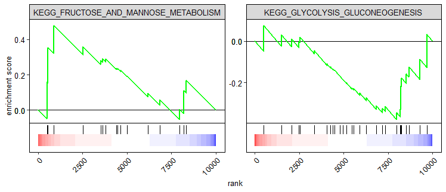

# gggsea

An R package that draws GSEA plots in [ggplot2](https://ggplot2.tidyverse.org/). The plot can easily be modified using ggplots standard options.



Table of contents:

- [Installation](#Installation)
- [Single-GSEA-plot](#Single GSEA plot)
- [Multiple-GSEA-plots](#Multiple GSEA plots)
- [Customization](#Customization)

# Installation
Install the package from the git repository:
``` r
devtools::install_github("nicolash2/gggsea")
```

# Single GSEA plot

The heart of gggsea is the function gseaCurve. It will return a data.frame that has all necessary values to produce a GSEA plot. To plot the data, one could either use general ggplot function (like geom_path) or use gggsea's inbuilt geoms.
To use gseaCurve you need 2 things: a sorted vector, and a list of gene sets. Here we will use gggsea's inbuilt data. Note that from the list of gene sets we will only use one gene set! For using several gene sets at once, look at the next section.

``` r
library(gggsea)
myRL <- gggsea::myRankedlist #the sorted vector must be a named! The names are gene IDs and the actual values are numbers (some metric, e.g. log2FC)
mySetlist <- gggsea::mySetlist #this list must be named! Each list item is a vector of gene IDs

print(head(myRL))
print(mySetlist)

#df needs the ranked list and a 
df <- gseaCurve(myRL, mySetlist[1])
```
We feed the output from gseaCurv to the geom_gsea function

```r
ggplot2::ggplot() + 
  geom_gsea(df)
```


We can add the gsea_theme.

```r
ggplot2::ggplot() + 
  geom_gsea(df) +
  theme_gsea()
```


# Multiple GSEA plots

If we want to vizualize several sets at once (against the same ranked list), we can do that and simply tell ggplot to do a facet_wrap:


```r
df <- gseaCurve(myRL, mySetlist[1:2])

ggplot2::ggplot() + 
  geom_gsea(df) +
  ggplot2::facet_wrap(~set, scale="free") +
  theme_gsea(textsize = 10)
```

