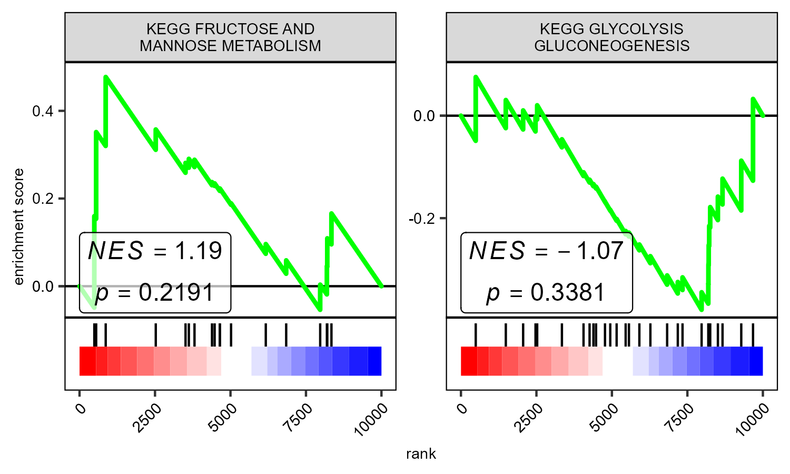
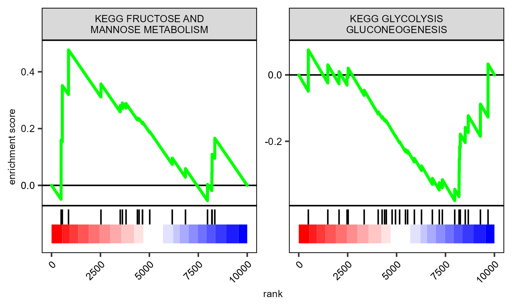
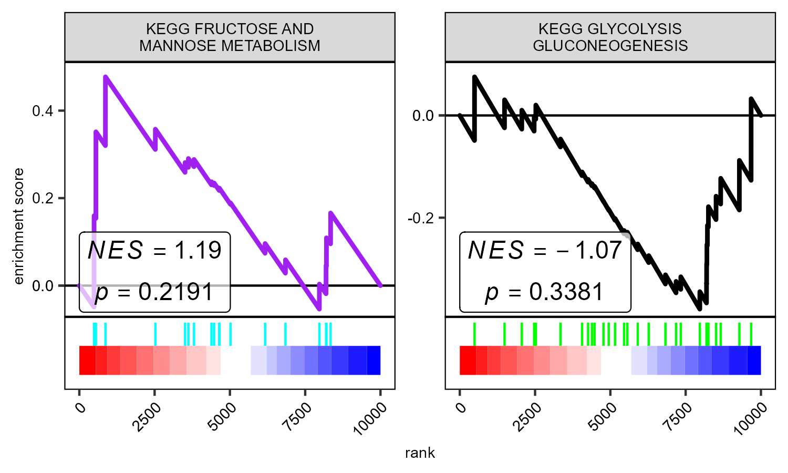
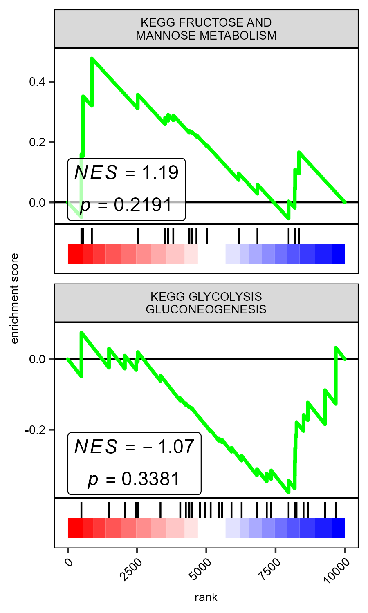

# gggsea

An [R](https://www.r-project.org) package that draws GSEA plots in [ggplot2](https://ggplot2.tidyverse.org/). The plot can easily be modified using ggplots standard options.



Table of contents:

- [Installation](#Installation)
- [Regular GSEA plot](#GSEA-plot)
- [Customization](#Customization)

# Installation
Install the package from the git repository:
``` r
devtools::install_github("nicolash2/gggsea")
```

# Regular GSEA plots

The heart of gggsea is the function gseaCurve. It will return a data.frame that has all necessary values to produce a GSEA plot. To plot the data, one could either use general ggplot function (like geom_path) or use gggsea's inbuilt geoms.
To use gseaCurve you need 2 things: a sorted vector, and a list of gene sets. Here we will use gggsea's inbuilt data. Note that from the list of gene sets we will only use one gene set! For using several gene sets at once, look at the next section.

``` r
library(gggsea)
library(ggplot2)
rl <- gggsea::myRankedlist #the sorted vector must be named! The names are gene IDs and the actual values are numbers (some metric, e.g. log2FC)
setlist <- gggsea::mySetlist #this list must be named! Each list item is a vector of gene IDs

print(head(rl))
print(setlist)

#df needs the ranked list and a set list
df <- gseaCurve(rl, setlist)
```
We feed the output from gseaCurve to the geom_gsea function

```r
ggplot2::ggplot() + 
  geom_gsea(df)
```


We can add the gsea_theme.

```r
ggplot2::ggplot() + 
  geom_gsea(df) +
  theme_gsea(7) #the number defines the textsize
```



We can add statistics to the plot. gggsea does not calculate statistics! They have to be provided as a data.frame with at least these 3 columns: pathway, NES, pval.  The calculation can e.g. be done via the [fgsea](https://bioconductor.org/packages/release/bioc/html/fgsea.html) package. You can change the size of the statistics vie the labelsize parameter in geom_gsea. It will be unaffacted by the size set with theme_gsea.

```r
gsea <- fgsea::fgsea(setlist, rl, nperm=1000)
df2 <- gseaCurve(rl, setlist, gsea)

ggplot2::ggplot() + 
  geom_gsea(df2) + 
  theme_gsea(7)
```


# Customization

Changing colors and sizes

```r
ggplot2::ggplot() + 
  geom_gsea(df2, linecolor=c("black","purple"), tickcolor=c("green", "cyan")) + # you can also set linesize and ticksize
  theme_gsea(7)
```


Add a zero-line. This line will be drawn at the point gene with the lowest metric. If several genes have the lowest metric, the line will be drawn at the middle of these genes.

```r
ggplot2::ggplot() + 
  geom_gsea(df2, zeroline = T) +
  theme_gsea(7)
```


Changing rows and columns

```r
ggplot2::ggplot() + 
  geom_gsea(df2, nrow=2) + # you can also set ncol
  theme_gsea(7)
```


Changing the title width to accomodate different text sizes

```r
ggplot2::ggplot() + 
  geom_gsea(df2, titlelength = 5) +
  theme_gsea(7)
```


Stop gggsea's behaviour of removing underscores. However, titles without spaces do not receive linebreaks.

```r
ggplot2::ggplot() + 
  geom_gsea(df2, replaceUnderscores = FALSE) +
  theme_gsea(7)
```

